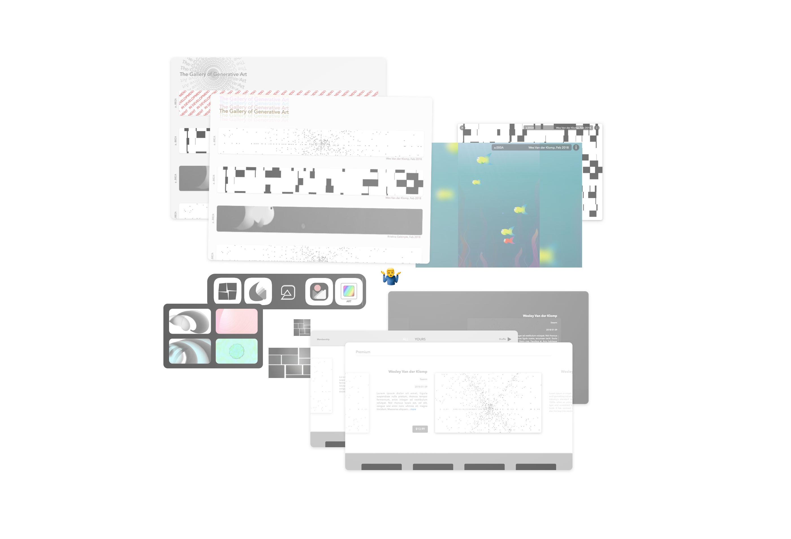

A platform for graphics programmers to create and publish weird generative art. We're starting with a tvOS app because it seems like fun. The hope is to build frameworks and tools for creation as well. This is just an exploration - we don’t really know what it's going to turn into.

